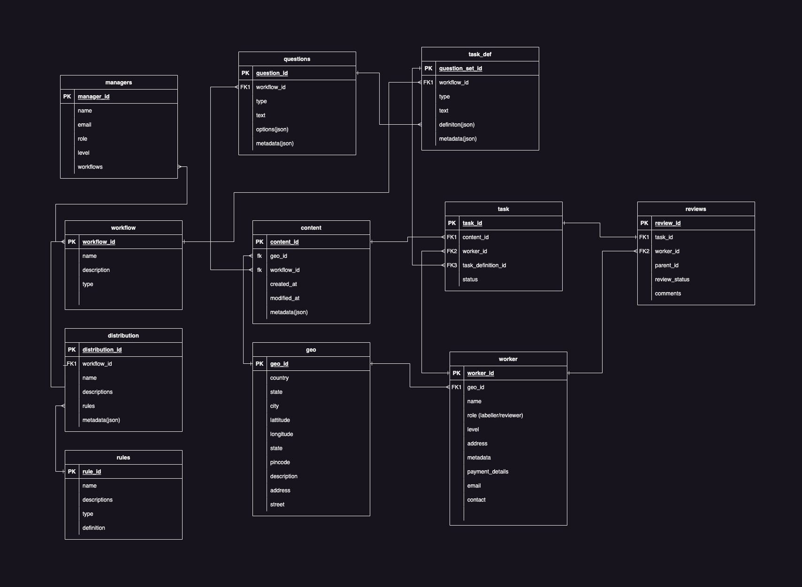

# DB Schema Docs

- Database uses postgresql
- Database schema can change over time, so we need to keep track of the changes.
- (Recommended) 4GB of RAM and 2 CPU cores.

### Schema Design

[Link to Draw.io schema](https://drive.google.com/file/d/1KqCQqKwO481QWr-JoT0c0kJpHm9l_OU7/view?usp=sharing) |
[Link to Flowchart](https://drive.google.com/file/d/1CPVYoMfFeiD0MQuTLfHHZBTkKVOis69U/view?usp=sharing)

Note: The schema is subject to change, Please refer to the latest schema in the codebase.

### Tables

#### workflow

- This table stores the workflow details. 
- Top level object in the schema.

#### content

- This table stores the content details.
- This table is a child of workflow table.
- This table stored the data to be probed by workers

#### geo

- This table stores the geo details.
- This table is used to store the geo details of the workflow objects
- This table can also be assigned to worker to link and sort them based on their geo location

#### worker

- This table stores the worker details.
- Worker are people who are assigned to a task in a workflow.
- Worker can be assigned to multiple tasks in a workflow.
- Workers can have multiple roles in a workflow.
- Workers can have different experience levels.

#### task

- This table stores the task details.
- Task are the smallest unit of work in a workflow.
- Task can be assigned to multiple workers.

#### task_definition

- This table stores the task definition details.
- Task definition contains the way a task is to be performed.
- Task definition contains the question to be asked to the worker.

#### questions

- This table stores the question details.
- Question are the smallest unit of work in a task definition.
- Question can be assigned to multiple task definitions.

#### rules

- This table stores the rules details.
- Rules define how a worker is to be assigned to a task.
- Rules define how a many tasks are to be assigned to a worker.

#### distribution

- This table stores the distribution details.
- Distribution defines how a task is to be distributed to workers.
- Distribution may contain several rules. 

#### review

- This table stores the review details.
- Reviews are the feedback given by the worker to the task.
- Reviews are given by the worker to the task definition.
- Reviews can be given to another review.

#### managers

- This table stores the managers details.
- Managers are the people who manage and create a workflow.
- Managers can be assigned to multiple workflows.
- Managers can have multiple roles in a workflow.

